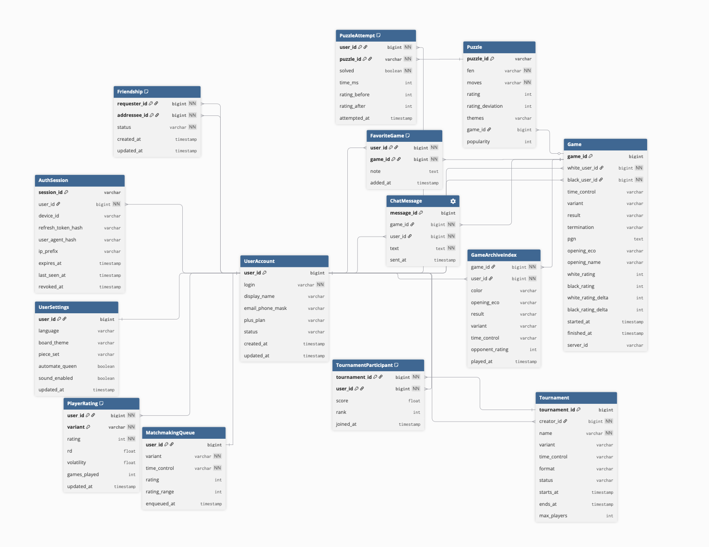
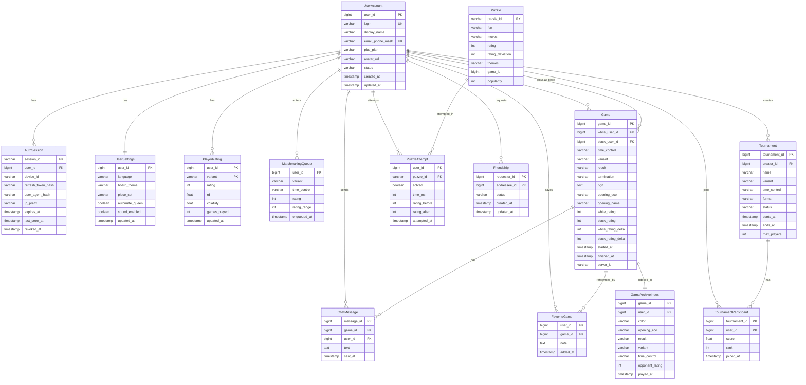

# Chess.com

## 1. Тема и целевая аудитория

chess.com - платформа, позволяющая пользователям со всего мира играть в шахматы и улучшать свои тактическе навыки путем решения задачек

### MVP
- Регистрация/авторизация;
- Соревновательный подбор партий;
- Общение в чате партии;
- Создание онлайн турниров;
- Решение шахматных задач подходящей сложности;
- Возможность добавлять других пользователей в друзья;
- Возможность добавлять партии в избранное;
- Возможность поиска патрий в архиве по обшироному списку параметров. В их числе такие как: разыгранный дебют, звание противника, цвет котороым играл и многие другие;

### Ключевые особенности сервиса
- Поиск оппонентов только со схожим рейтингом;
- Обширый архив сыгранных партий, можно посмотреть любую партию когда-либо сыгранную;


### Целевая аудитория
- MAU 57 млн [^1];
- DAU 7-10 млн [^2];
- AVD 15:47мин [^3];
- Визитов в месяц всего 148.13 млн [^3];
- Количество зарегистрированных аккаунтов 249,5 млн [^4];
- Партий сыграно в год 6 миллиардов [^5];


### Анализ целевой аудитории

#### Демографическое распределение
- женщины: 34.9% [^6];
- мужчины: 65.1% [^6];

#### Возрастное распределение
- 56% в возрасте от 18-34;
- 20% 35-54 [^6];

#### Распределение трафика по странам [^3]
| Страна          |Процент пользователей |
| :-------------: | :------------------: |
| United States   | 19.61%               |
| India           | 8.81%                |
| France          | 4.73%                |
| Germany         | 4.53%                |


 
*Распределение трафика по странам [^3]*

## 2. Расчет нагрузки

### 2.1 Продуктовые метрики

Для расчетов используются показатели аудитории из п.1, а также статистические данные об активности пользователей из открытых источников.

#### Сводная таблица продуктовых метрик
| Метрика         | Значение             | Источник            |
| :-------------: | :------------------: | :------------------:|
| MAU  | 57 млн              |      [^1]              |
| DAU  | 8,5 млн                |         [^2]            |
| Партий в день | 20 млн              |         [^7]            |
| Партий на пользователя | 2.35               |          см. обоснование            |
| Средняя длительность партии | 6.2 мин            |      [^8]               |
| Среднее количество ходов в партии | 80            |       [^9]              |
| Среднее время на ход | 4.65 с        |           см. обоснование           |
| Размер хода (клиент-сервер) | 40 байт            |            см. обоснование        |
| Размер обновления (сервер-клиент, свой ход) | 150 байт            | см. обоснование                    |
| Размер обновления (сервер-клиент, ход противника) | 300 байт            |   см. обоснование                 |
| Средний размер WebSocket-обмена на 1 ход | 490 байт            |   см. обоснование                  |
| Средний размер FEN-строки | 70 байт |         [^11]          |
| Средний размер задачи (puzzle) | 500 байт |      см. обоснование             |
| Задач на пользователя в день | 4.12 |      см. обоснование             |

#### Обоснование метрик
- (Партий в день) / DAU
- (Средняя длительность партии) / (Среднее количество ходов в партии)
- WS-фрейм: `{"t":"move","d":{"u":"d2d4","l":32,"a":1}}` [^11]
- Фрейм с полями uci, san, fen (70 байт), ply, clock [^11]
- Те же поля + `dests` (20–30 доступных ходов * 6 байт) [^11]
- Те же поля + `dests` (20–30 доступных ходов * 6 байт) [^11]
- 40  + 150 + 300 = 490 байт/ход
- FEN (70 байт) + список ходов-решений + метаданные (рейтинг, темы, game_id)
- 35 млн задач в день [^12] / dau

### 2.2 Технические метрики

#### Расчёт объёма хранения

- Расчёт производится для хранения данных, генерируемых за 1 год использования сервиса.
- Средний размер записи партии 2.5kb.

| Тип данных         | Формула расчёта             | Общий объём            |
| :-------------: | :------------------: | :------------------:|
| Записи сыгранных партий (PGN)  | 20 млн партий/сут * 365 * 2.5 Кбайт             |      17 Тбайт             |
| Профили пользователей + рейтинги  |  250 млн аккаунтов * 2 Кбайт | 0,5 Тбайт |
| База шахматных задач (puzzles) | 600_000[^13] * 500 байт              |         3 Мбайта           |

#### Сетевой трафик

При расчёте используется коэффициент суточной неравномерности k = 2 для определения пиковой нагрузки.

| Тип трафика | Суточный объём (Гбайт/сут) | Средний трафик (Гбит/с) | Пиковый трафик k=2 (Гбит/с) |
| :-------------: | :-------------:| :-------------: | :-------------: |
| WebSocket-ходы | 20 млн * 80 ходов * 490 байт = 784 Гб | 0,073 | 0,146 |
| Синхронизация / heartbeat | 8,5 млн * 16 сессий * 300 байт = 41 | 0,004 | 0,008 |
| Загрузка архива партий | 8,5 млн * 1 * 3 запр. * 10 Кбайт = 255 | 0,024 | 0,048 |
| Раздача задач (puzzles) | 8,5 млн * 4,12 * 500 байт = 17 | 0,002 | 0,004 |
| Статика | 8,5 млн * 1 загрузка * 150 Кбайт = 1 275 | 0,118 | 0,236 |
| Итого | 2 372 ГБ | 0,220 | 0,440  |

#### Расчёт RPS (Requests Per Second)

RPS рассчитывается по формуле: RPS = (Запросов в сутки) / 86 400

| Тип запроса | Запросов в сутки | Средний RPS | Пиковый RPS k=2 |
| :-------------:  | :-------------:  | :-------------:  | :-------------: |
| Матчмейкинг (поиск партии) | 8,5 млн * 2,35 = 20 млн | 231 | 462 |
| WebSocket-фреймы (ходы + state) | 20 млн * 80 ходов * 3 фрейма = 4,8 млрд | 55 556 | 111 112 |
| Синхронизация / статус | 8,5 млн * 16 сессий = 136 млн | 1 574 | 3 148 |
| Загрузка и решение задач (puzzles) | 8,5 млн * 4,12 = 35 млн | 405 | 810 |
| Поиск и просмотр архива партий | 8,5 млн * 1 * 3 = 25,5 млн | 295 | 590 |
| Обновление рейтинга (после партии) | 20 млн * 2 игрока = 40 млн | 463 | 926 |
| Итого | 5,06 млрд | 58 524 | 117 048 |

## 3. Глобальная балансировка нагрузки

### 3.1 Функциональное разбиение по доменам

Для оптимизации обработки разнородных запросов и независимого масштабирования сервисов используются следующие домены:

| Доменное имя | Назначение |
| :-------------: | :-------------: |
| api.chess.com | Матчмейкинг, рейтинг, профили, турниры, друзья, поиск архива |
| game.chess.com | WebSocket-сервер игровых сессий (обмен ходами в реальном времени) |
| puzzles.chess.com | Сервис шахматных задач — выдача позиций и проверка решений |
| archive.chess.com | Поиск и просмотр архива партий   |
| static.chess.com | Статика |

### 3.2 Расположение дата-центров [^14]

| ID | Локация | Обслуживаемый регион |
| :---: | :---: | :---: |
| DC1, DC2 | Орегон, Вирджиния (США) | Северная и Южная Америка |
| DC3 | Нидерланды | Европа, Африка |
| DC4 | Индия | Азия |

Chess.com развернул Realtime Chess Network — глобально распределённую сеть игровых серверов, обслуживающую 94% всех партий [^14].

#### Обоснование выбора

- США (DC1, DC2) —  основные сервера; охватывают крупнейший рынок (19,6% трафика). 
- Нидерланды (DC2, DC4) — европейский узел;
- Индия (DC5) —  сервер для второго по величине рынка (8,8% трафика). 

#### Логика размещения данных

- Профили и рейтинги реплицируются во все ДЦ. Запись — в ДЦ пользователя, репликация асинхронная.
- Партии сохраняются на game-сервере с минимальной суммой RTT до обоих участников. Ходы буферизуются в памяти; flush в БД при завершении партии [^11].
- База задач полностью реплицируется во все ДЦ.
- Архив партий — eventual consistency; индексы поиска строятся локально в каждом ДЦ.

### 3.3 Распределение запросов по ДЦ

Нагрузка распределяется пропорционально аудитории регионов. Пиковый RPS — 117 048 (п. 2.2). 94% партий обслуживается Realtime Chess Network; 6% (арены, варианты, старые мобильные клиенты) — legacy-серверами в США [^13].


| Регион (ДЦ) | Процент трафика | Средний RPS | Пиковый RPS | Обоснование |
| :---: | :---: | :---: | :---: | :---: |
| Америка (DC1, DC2) | 40% | 23409 | 46 819 | США — 1-й рынок (19,6%) + Латинская Америка |
| Европа (DC3) | 30% | 17557 | 35114 | Франция 4,7% + Германия 4,5% + остальная Европа |
| Азия (DC4) | 30% | 17557 | 35114 | Индия — 2-й рынок (8,8%) + остальная Азия |
| Итого | 100% | 58 524 |117 048 | |


### 3.4 Схема балансировки

1 уровень (Geo-based DNS)

| Домен | Что запрашивается | Куда направляется |
| :---: | :---: | :---: |
| api.chess.com | REST-запросы | IP ближайшего ДЦ по геолокации |
| game.chess.com | WebSocket (ходы, state update) | IP game-сервера с минимальным суммарным RTT до обоих игроков [^13] |
| puzzles.chess.com | Задачи | IP ближайшего ДЦ |
| archive.chess.com | Поиск партий | IP ДЦ с данными пользователя |
| static.chess.com | Статика | CDN-edge |

2 уровень (выбор game-сервера)

- Матчмейкинг — пара подбирается по рейтингу; геолокация не учитывается [^13].
- Выбор сервера — из доступных выбирается game-сервер с наименьшей суммой RTT до обоих игроков [^13].
- Подключение — оба клиента открывают WebSocket к выбранному серверу; сессия аффинна к нему до конца партии.
- Сохранение — ходы буферизуются; flush в БД при завершении партии или особых событиях [^11].

### 3.5 Механизмы регулировки трафика

- Geo DNS — первичная маршрутизация до ближайшего ДЦ.
- RTT-based Game Server Selection — выбор game-сервера с минимальной суммарной задержкой для обоих игроков [^13].

## 4. Локальная балансировка нагрузки

### 4.1 Схема балансировки

Внутри дата-центра реализована двухуровневая схема балансировки:

#### L4-балансировщик:

| Параметр | Описание |
| :---: | :---: |
| Реализация | LVS (Linux Virtual Server) |
| Режим работы | Virtual Server via Direct Routing. Входящий трафик распределяется между узлами L7, а исходящий трафик идёт напрямую к клиенту, что минимизирует нагрузку на балансировщик. |
| Резервирование | Схема N * 2. Keepalived обеспечивает автоматическое переключение Virtual IP на резервный узел при отказе основного. |

#### L7-балансировщик:

| Параметр | Описание |
| :---: | :---: |
| Реализация | Кластер серверов nginx (Reverse Proxy) |
| Функции | SSL Termination, распределение запросов по микросервисам |
| Оптимизация | Session tickets для ускорения повторных TLS-соединений |
| Резервирование | Схема N + 1 |

### 4.2 Расчёт количества балансировщиков

Расчёт выполнен для наиболее загруженного региона — Америка (DC1/DC2), на который приходится 40% пиковой нагрузки.

- 0,440 Гбит/с * 0,4 = 0,176  Гбит/с (176 Мбит/с)
- Пиковая нагрузка: 46 819 RPS  

### 1. Расчёт узлов L4

Лимитирующий фактор — пропускная способность канала, но при 176 Мбит/с даже один сервер с 10GbE справляется с запасом. Однако для отказоустойчивости и обслуживания необходимо минимум два узла в режиме Active-Passive.

Итого: 2 сервера (1 активный + 1 резервный).

### 2. Расчёт узлов L7

Конфигурация узлов: 16 CPU, NIC 100GbE. Учитываются два ограничителя: пропускная способность и SSL Termination.

По пропускной способности:

176 Мбит/с / 10 Гбит/с = 0,0176 => 1 сервер

По SSL Termination:

Интенсивность новых TLS-соединений принята равной 50% от общего RPS:

46 819  RPS * 0,5 = 24 400  CPS

При производительности одного сервера 6 676 CPS [^15]:

24 400 CPS / 6 676 CPS =  3.66 => 4 сервера

Выбираем большее значение — 4 сервера. С учётом резервирования N + 1 добавляем ещё один сервер.

Итого: 5 серверов.

### 4.3 Итоговая конфигурация оборудования

| Уровень | Количество | Конфигурация узла | Тип резервирования |
| :---: | :---: | :---: | :---: |
| L4 | 2 | CPU 8 Cores, NIC 10GbE | Active-Passive |
| L7 | 5 | CPU 16 Cores, NIC 10GbE | N + 1 |


## Часть 5. Логическая схема БД
 
### Выделение сущностей и хранилищ из текущей специфики
 
- **Пользовательский контур:** аккаунт, настройки (тема доски, фигуры, язык), сессии/устройства.
- **Рейтинговый контур:** рейтинг по вариантам (`PlayerRating`); очередь матчмейкинга (`MatchmakingQueue`).
- **Игровой контур:** завершённая партия (`Game`) с хранением PGN и метаданных; чат партии (`ChatMessage`); индекс архива для поиска (`GameArchiveIndex`); избранные партии (`FavoriteGame`).
- **Социальный контур:** дружба (`Friendship`); турниры (`Tournament`, `TournamentParticipant`).
- **Задачи (Puzzles):** база позиций (`Puzzle`); попытки решения (`PuzzleAttempt`).
- **Производные данные:** кэш результатов поиска по архиву (`ArchiveSearchCache`); кэш рейтингового лидерборда (`RatingLeaderboardCache`).
- **Буферы и edge-данные:** буфер ходов активной партии в памяти (`GameMoveBuffer`); WebSocket-состояние сессии на game-сервере.
 
- самая тяжёлая запись — WebSocket-ходы активной партии (`~111k` peak write RPS по фреймам), поэтому состояние активной партии нельзя сразу писать в durable store — нужен in-memory буфер с flush по завершении партии;
- матчмейкинг — горячая очередь с постоянной вставкой и удалением, требует отдельного быстрого хранилища с поддержкой диапазонного поиска по рейтингу;
- `GameArchiveIndex` — тяжёлый read-сценарий поиска по множеству параметров (дебют, вариант, рейтинг, цвет, результат), требует отдельного индексного хранилища с составными индексами;
- база задач целиком помещается в память (~3 МБ) и реплицируется во все регионы — никакого шардирования не требует;
- рейтинговый лидерборд читается очень часто при открытии соответствующих страниц и должен предрасчитываться, а не вычисляться на лету из `PlayerRating`.

### Логическая схема

 
*Логическая схема*

### Таблица сущностей и хранилищ


Все значения ниже — **пиковые оценки** для логической схемы.
Для `GameMoveBuffer`, `ArchiveSearchCache` и `RatingLeaderboardCache` цифры получены инженерным разложением нагрузок из части 2, так как эти производные хранилища не фигурировали отдельными строками RPS, но являются необходимой частью операционной архитектуры.
 
| Сущность / хранилище | Назначение и ключ | Оценка размера | Peak read QPS | Peak write QPS | Требование к консистентности | Особенности нагрузки по ключам |
|:---:|:---:| :---: | :---:| :---:|:---:|:---:|
| `UserAccount` | Профиль пользователя. Ключ: `user_id` | `~1 KB/row`, `~250M` аккаунтов, всего `~250 GB` | `~500` | `~10` | **Strong** | Распределение по `user_id` близко к равномерному; горячих ключей практически нет — профиль читается при логине и меняется редко |
| `UserSettings` | Настройки доски, набора фигур, языка, звука, автоферзя. Ключ: `user_id` | `~0.5 KB/row`, всего `~125 GB` | `~300` | `~50` | **Strong**, read-after-write для владельца | Хорошее распределение по `user_id`; запись только по явному действию пользователя, конфликтов нет |
| `AuthSession` | Refresh-токены, устройства, активные сессии. Ключ: `session_id`, secondary по `user_id` | `~0.5 KB/row`, `2–3` сессии на пользователя, всего `~125–375 GB` | `~3 148` | `~3 148` | **Strong** | Нагрузка концентрируется на активных сессиях DAU; удобнее шардировать по `user_id` для локальности, дополнительный индекс по `session_id` для lookup при валидации токена |
| `PlayerRating` | Рейтинг Глико-2 по вариантам (blitz, rapid, bullet, classical и др.). Составной ключ: `(user_id, variant)` | `~64 B/row`, `~5` вариантов на пользователя, всего `~80 GB` | `~926` | `~926` | **Strong** на момент обновления после партии; read-after-write для владельца | Запись строго по завершении партии; умеренный перекос — активные игроки генерируют значительно больше обновлений; агрегированный рейтинг для лидерборда предрасчитывается отдельно |
| `MatchmakingQueue` | Очередь подбора партнёра. Ключ: `user_id`, secondary по `(variant, time_control, rating)` | `~64 B/row`, не более числа одновременно ищущих пользователей, `~1 GB` peak | `~462` | `~924` | **Strong** на вставку и удаление; при аварии допускается повторная постановка в очередь | Очень частые вставка и удаление (каждый старт и конец поиска); критичен быстрый диапазонный поиск по рейтингу для подбора пары; хранилище должно поддерживать атомарное «взять и удалить» |
| `Game` | Завершённая партия с PGN, метаданными, дельтой рейтингов. Ключ: `game_id` | `~2.5 KB/row`, `20M` партий/сут, `~17 TB/год` | `~590` | `~231` | **Strong** при записи по завершении партии (flush из буфера); read eventual через `GameArchiveIndex` | Запись происходит один раз при завершении; чтение смещено в сторону свежих партий и партий знаменитых игроков — выраженный Zipf-перекос по `game_id`; горячие записи должны уходить в `ArchiveSearchCache` |
| `FavoriteGame` | Избранные партии пользователя. Составной ключ: `(user_id, game_id)` | `~64 B/row`, небольшой объём, `~5 GB` | `~200` | `~50` | **Strong**, read-after-write для владельца | Равномерное распределение по `user_id`; горячих ключей нет; дополнительные поля `note` позволяют хранить аннотацию к партии |
| `ChatMessage` | Сообщения чата внутри партии. Ключ: `message_id`, secondary по `(game_id, sent_at)` | `~256 B/row`, TTL-хранение после завершения партии, `~10 GB` peak | `~1 000` | `~500` | **Eventual**; задержка доставки в секунды приемлема; порядок сообщений гарантируется монотонным `message_id` | Нагрузка сосредоточена строго на активных партиях; после завершения партии сообщения практически не читаются — можно архивировать с TTL или переносить в cold storage |
| `GameArchiveIndex` | Денормализованный индекс для поиска партий по параметрам (дебют, вариант, рейтинг противника, цвет, результат, дата). Составной ключ: `(user_id, played_at)`, secondary по `opening_eco`, `variant`, `result`, `time_control` | `~256 B/row`, `~5 TB` | `~590` | `~231` | **Eventual** относительно `Game`; строится асинхронно после flush по завершении партии | Высокий перекос по свежим партиям и знаменитым игрокам; диапазонные запросы по нескольким условиям одновременно — нужен составной индекс; записи добавляются по одной, никогда не обновляются |
| `Puzzle` | База шахматных задач: позиция FEN, ходы-решения, рейтинг, отклонение рейтинга, темы, ссылка на исходную партию. Ключ: `puzzle_id` | `~500 B/row`, `~600k` задач, всего `~300 MB` | `~810` | `<1` | **Strong** на master; eventual-репликация во все регионы | Целиком помещается в память; горячий set определяется рейтингом пользователя и популярностью задачи; запись крайне редкая (добавление новых задач в базу) |
| `PuzzleAttempt` | Попытки решения задач пользователем: результат, время, дельта рейтинга задачи. Составной ключ: `(user_id, puzzle_id)` | `~64 B/row`, `35M` попыток/сут, `~2 TB/год` | `~810` | `~810` | **Strong** для записи результата; для агрегатной статистики по задаче — eventual | Распределение по `user_id` широкое и равномерное; перекос по `puzzle_id` умеренный — популярные задачи решаются чаще |
| `Friendship` | Связь «друзья» между пользователями: статус (pending / accepted / blocked). Составной ключ: `(requester_id, addressee_id)` | `~64 B/row`, небольшой объём, `~5 GB` | `~200` | `~30` | **Strong** для записи и смены статуса; read-after-write для обоих участников | Хорошее распределение по `requester_id`; необходим двусторонний secondary-индекс для запросов «кто в друзьях у данного пользователя» |
| `Tournament` | Метаданные турнира: создатель, вариант, контроль времени, формат, статус, временны́е рамки. Ключ: `tournament_id` | `~512 B/row`, небольшой объём, `~1 GB` | `~300` | `~20` | **Strong** | Распределение равномерное; горячие ключи возникают у крупных публичных турниров в момент старта |
| `TournamentParticipant` | Участие в турнире: счёт, ранг, время вступления. Составной ключ: `(tournament_id, user_id)` | `~64 B/row`, небольшой объём, `~2 GB` | `~300` | `~100` | **Strong** при вступлении и обновлении счёта; eventual для рейтинговой таблицы турнира | Нагрузка концентрируется на активных публичных турнирах; обновление счёта происходит по завершении каждой партии внутри турнира |
| `GameMoveBuffer` | Быстрый in-memory буфер ходов активной партии на game-сервере до flush по завершении. Ключ: `game_id` | `~128 B/ход × ~80 ходов = ~10 KB/партия`; при `~400k` одновременных партий `~4 GB` | `~111 112` | `~111 112` | **In-memory, per-game monotonic**; допускается потеря последних ходов при аварии game-сервера (партия пересчитывается по сохранённым ходам); backward rollback прогресса недопустим | Нагрузка строго привязана к game-серверу, обслуживающему партию; шардирование по `game_id` с аффинностью к серверу на всё время жизни партии |
| `ArchiveSearchCache` | Кэш результатов поисковых запросов к `GameArchiveIndex` (топ-N партий по фильтрам). Ключ: хэш параметров запроса `(user_id, filters)` | `~10 KB/entry`, горячий set `~10–50k` уникальных запросов, `~500 MB` | `~2 000` | `~200` | **Eventual**, TTL-based инвалидация | Сильный перекос: популярные комбинации фильтров (последние партии, определённый дебют) покрывают основную долю трафика; инвалидация по TTL `~60 сек` достаточна |
| `RatingLeaderboardCache` | Предрасчитанные топ-N игроков по рейтингу на вариант. Ключ: `(variant, page)` | `~1 KB/page`, несколько страниц на вариант, `<100 MB` | `~1 000` | `~5` | **Eventual**; пересчитывается раз в несколько минут из `PlayerRating` | Целиком помещается в память; нагрузка широкая и равномерная, горячих одиночных ключей нет; пересчёт запускается по расписанию или по триггеру при значимом изменении рейтинга топ-игрока |

## 6. Физическая схема БД

### 6.1 Денормализация

Для снижения нагрузки на наиболее горячие read-пути применяется ряд денормализаций:

1. В `Game` хранится `server_id` — идентификатор game-сервера, на котором была сыграна партия. Это позволяет при отладке инцидентов и при replay-сценариях обращаться к нужному серверу напрямую, не восстанавливая маршрут через матчмейкинг.
2. В `Game` хранятся `white_rating`, `black_rating`, `white_rating_delta`, `black_rating_delta` — снимок рейтингов на момент партии. Без денормализации пришлось бы джойнить `PlayerRating` с учётом исторического состояния, что невозможно в append-only модели рейтинга.
3. В `GameArchiveIndex` полностью дублируются поля `opening_eco`, `variant`, `result`, `time_control`, `opponent_rating`, `color` из `Game`. Это позволяет выполнять поиск по архиву без обращения к основному хранилищу партий — `GameArchiveIndex` является самодостаточным индексным документом.
4. `PlayerRating` хранит не только текущий рейтинг, но и параметры системы Глико-2 (`rd`, `volatility`). Они технически являются производными от истории партий, но пересчитываются инкрементально и хранятся как актуальное состояние, а не вычисляются каждый раз заново.
5. Содержимое медиафайлов (аватары пользователей, изображения в профиле) вынесено из реляционных таблиц в объектное хранилище; в PostgreSQL остаётся только `avatar_url` в `UserAccount`.
6. `RatingLeaderboardCache` — полностью денормализованная проекция `PlayerRating`, предрасчитанная по каждому варианту и странице. Устраняет агрегатный `ORDER BY rating DESC LIMIT N` по многомиллионной таблице при каждом открытии страницы лидерборда.

### 6.2 Физическая схема



### 6.3 Выбор СУБД

| Таблица / хранилище | СУБД | Обоснование |
| :---: | :---: | :---: |
| `UserAccount`, `UserSettings`, `Friendship`, `Tournament`, `TournamentParticipant`, `FavoriteGame` | **PostgreSQL** | ACID-транзакции, строгая консистентность, небольшой объём с умеренной нагрузкой; реляционные связи между сущностями пользовательского и социального контура |
| `PlayerRating` | **PostgreSQL** | Строгая консистентность обязательна — рейтинг обновляется атомарно после каждой партии; объём таблицы умеренный (~80 GB) |
| `Game`, `GameArchiveIndex`, `PuzzleAttempt` | **ScyllaDB** | Высокие RPS записи и чтения, write-heavy нагрузка; партиционирование по `game_id` / `user_id` обеспечивает линейное масштабирование; `GameArchiveIndex` требует эффективных range-запросов по составному ключу |
| `AuthSession` | **Redis** | Низкая задержка при валидации каждого запроса; TTL-управление сессиями из коробки; объём полностью помещается в память |
| `MatchmakingQueue` | **Redis (Sorted Set)** | Атомарные операции `ZADD` / `ZRANGEBYSCORE` / `ZPOPMIN` позволяют вести очередь с диапазонным поиском по рейтингу без блокировок; мгновенный отклик критичен для пользовательского опыта |
| `GameMoveBuffer` | **In-process memory на game-сервере** | Ходы партии живут исключительно на одном game-сервере (аффинность по `game_id`); запись в durable store происходит только по завершении — промежуточная персистентность не нужна |
| `ChatMessage` | **ScyllaDB** | Append-only запись, чтение строго по `game_id`; TTL-архивирование после завершения партии; хорошо ложится на модель wide-row |
| `Puzzle` | **PostgreSQL + полный in-memory кэш** | База задач (~300 MB) целиком помещается в память на каждом узле; PostgreSQL служит durable-источником при рестарте; запись крайне редкая |
| `ArchiveSearchCache`, `RatingLeaderboardCache` | **Redis** | Предрасчитанные результаты с TTL-инвалидацией; весь горячий set помещается в память; низкая задержка чтения |
| Аватары, медиа профиля | **S3-совместимое объектное хранилище** | Бинарный контент не хранится в СУБД; в `UserAccount` остаётся только `avatar_url` |

Итого по СУБД:

- **PostgreSQL:** `UserAccount`, `UserSettings`, `PlayerRating`, `Friendship`, `Tournament`, `TournamentParticipant`, `FavoriteGame`, `Puzzle` (durable copy).
- **ScyllaDB:** `Game` (partition key: `game_id`), `GameArchiveIndex` (partition key: `user_id`, clustering key: `played_at DESC`), `PuzzleAttempt` (partition key: `user_id`, clustering key: `attempted_at DESC`), `ChatMessage` (partition key: `game_id`, clustering key: `message_id ASC`).
- **Redis:** ключи вида `session:{session_id}`, sorted set `matchmaking:{variant}:{time_control}`, `leaderboard:{variant}:{page}`, `archive_cache:{hash}`.
- **In-process:** `GameMoveBuffer` — map `game_id → []Move` на каждом game-сервере.
- **S3:** объекты по ключу из `UserAccount.avatar_url`.

### 6.4 Индексы

| Таблица | Поле / составной ключ | Тип индекса | Обоснование |
| :---: | :---: | :---: | :---: |
| `UserAccount` | `user_id` | B-Tree (PK) | Точечный доступ к профилю по ID |
| `UserAccount` | `login` | Hash (UNIQUE) | Поиск при авторизации по логину |
| `UserAccount` | `email_phone_mask` | Hash (UNIQUE) | Поиск при восстановлении доступа |
| `AuthSession` | `session_id` | Redis Key (PK) | Валидация токена при каждом запросе |
| `AuthSession` | `user_id` | Secondary (Redis Set) | Инвалидация всех сессий пользователя |
| `PlayerRating` | `(user_id, variant)` | B-Tree (Composite PK) | Точечный доступ к рейтингу по варианту |
| `PlayerRating` | `(variant, rating DESC)` | B-Tree | Построение лидерборда по варианту |
| `MatchmakingQueue` | `rating` (score в Sorted Set) | Redis Sorted Set | Диапазонный поиск пары по рейтингу (`ZRANGEBYSCORE`) |
| `Game` | `game_id` | ScyllaDB Partition Key | Точечный доступ к партии |
| `Game` | `white_user_id`, `black_user_id` | Secondary Index | Поиск партий конкретного игрока (используется редко, основной путь — через `GameArchiveIndex`) |
| `GameArchiveIndex` | `(user_id, played_at DESC)` | ScyllaDB Partition + Clustering Key | Пагинация архива пользователя по дате |
| `GameArchiveIndex` | `(user_id, opening_eco, played_at DESC)` | ScyllaDB Materialized View | Фильтрация архива по дебюту |
| `GameArchiveIndex` | `(user_id, variant, played_at DESC)` | ScyllaDB Materialized View | Фильтрация по варианту игры |
| `GameArchiveIndex` | `(user_id, result, played_at DESC)` | ScyllaDB Materialized View | Фильтрация по результату (win/loss/draw) |
| `ChatMessage` | `(game_id, message_id ASC)` | ScyllaDB Partition + Clustering Key | Последовательное чтение чата партии |
| `PuzzleAttempt` | `(user_id, attempted_at DESC)` | ScyllaDB Partition + Clustering Key | История решений пользователя |
| `PuzzleAttempt` | `(puzzle_id, attempted_at DESC)` | ScyllaDB Secondary Index | Агрегатная статистика по задаче |
| `Friendship` | `(requester_id, addressee_id)` | B-Tree (Composite PK) | Проверка существования связи |
| `Friendship` | `addressee_id` | B-Tree (Secondary) | Список входящих запросов / друзей со стороны addressee |
| `FavoriteGame` | `(user_id, game_id)` | B-Tree (Composite PK) | Проверка и добавление в избранное |
| `FavoriteGame` | `(user_id, added_at DESC)` | B-Tree | Список избранного по дате добавления |
| `Tournament` | `tournament_id` | B-Tree (PK) | Точечный доступ к турниру |
| `Tournament` | `(status, starts_at)` | B-Tree | Список активных и предстоящих турниров |
| `TournamentParticipant` | `(tournament_id, user_id)` | B-Tree (Composite PK) | Проверка участия и доступ к счёту |
| `TournamentParticipant` | `(tournament_id, score DESC)` | B-Tree | Турнирная таблица по очкам |
| `Puzzle` | `puzzle_id` | B-Tree (PK) | Точечный доступ к задаче |
| `Puzzle` | `(rating, popularity DESC)` | B-Tree | Подбор задач по уровню сложности пользователя |

### 6.5 Шардирование и резервирование

#### Шардирование

| Таблица / хранилище | СУБД | Ключ шардирования | Обоснование |
| :---: | :---: | :---: | :---: |
| `UserAccount`, `UserSettings`, `Friendship` | PostgreSQL | `user_id` | Равномерное распределение; все данные пользователя на одном шарде |
| `PlayerRating` | PostgreSQL | `user_id` | Все варианты рейтинга одного игрока на одном шарде; не требует кросс-шардовых запросов при обновлении |
| `Tournament`, `TournamentParticipant` | PostgreSQL | `tournament_id` | Все участники турнира на одном шарде; атомарные обновления турнирной таблицы без распределённых транзакций |
| `FavoriteGame` | PostgreSQL | `user_id` | Все избранные партии пользователя на одном шарде |
| `Game` | ScyllaDB | `game_id` (Partition Key) | Равномерное распределение; партия хранится целиком на одном узле |
| `GameArchiveIndex` | ScyllaDB | `user_id` (Partition Key) | Все партии пользователя в одном partition; range-запросы по `played_at` без cross-partition scatter |
| `ChatMessage` | ScyllaDB | `game_id` (Partition Key) | Все сообщения одной партии на одном узле; последовательное чтение без scatter-gather |
| `PuzzleAttempt` | ScyllaDB | `user_id` (Partition Key) | История решений пользователя в одном partition |
| `AuthSession` | Redis Cluster | `session_id` (hash slot) | Равномерное распределение ключей по слотам |
| `MatchmakingQueue` | Redis Cluster | `{variant}:{time_control}` (hash tag) | Все игроки одного варианта и контроля времени на одном слоте — атомарный `ZRANGEBYSCORE` без cross-slot операций |
| `ArchiveSearchCache`, `RatingLeaderboardCache` | Redis Cluster | Hash параметров запроса / `{variant}` | Равномерное распределение; локальность не критична для кэша |

### Резервирование

| СУБД | Схема | Обоснование |
| :---: | :---: | :---: |
| PostgreSQL | Master–Replica (1 мастер + 2 синхронные реплики). Запись строго на мастер, чтение с реплик. Автоматический failover через **Patroni + etcd** | Исключение единой точки отказа; синхронные реплики гарантируют нулевую потерю данных при переключении; чтение с реплик снижает нагрузку на мастер |
| ScyllaDB | Каждая партиция хранится на **3 узлах** (Replication Factor = 3). Консистенция **QUORUM** для записи и чтения. Автоматическое переключение при отказе узла | RF=3 + QUORUM гарантирует, что данные сохранятся даже при потере одного из трёх узлов; линейное масштабирование горизонтальным добавлением узлов |
| Redis | **Redis Cluster** (мастер + 1 реплика на каждый слот). Автоматический failover через Redis Sentinel | Отказоустойчивость при потере одного узла; сессии и очередь матчмейкинга восстанавливаются немедленно без ручного вмешательства |
| S3 | Георепликация между регионами (cross-region replication) | Медиафайлы профилей не теряются при отказе целого дата-центра; раздача через CDN снижает задержку для конечных пользователей |

### 6.6 Клиентские библиотеки и интеграции

| СУБД | Язык (Go) | Библиотека | Особенности использования |
| :---: | :---: | :---: | :---: |
| PostgreSQL | Go | `pgx` | Нативный бинарный протокол, поддержка prepared statements, pipeline-режим для пакетных обновлений рейтинга |
| ScyllaDB | Go | `gocql` + `gocqlx` | Token-aware routing; `gocqlx` добавляет маппинг структур и именованные параметры |
| Redis | Go | `go-redis` | Поддержка Cluster-режима, pipeline, Lua-скрипты для атомарных операций матчмейкинга |
| S3 | Go | `minio-go` | Presigned URL для прямой отдачи аватаров клиенту без проксирования через backend |

### 6.7 Балансировка запросов и мультиплексирование подключений

| СУБД | Механизм | Как работает |
| :---: | :---: | :---: |
| PostgreSQL | **PgBouncer** (пул соединений, transaction pooling) | Поддерживает ограниченный пул долгоживущих соединений к PostgreSQL; тысячи коротких запросов от backend-сервисов мультиплексируются в десятки реальных коннектов к БД. Transaction pooling позволяет освобождать соединение сразу по завершении транзакции, не удерживая его между запросами одной сессии |
| ScyllaDB | **Token-aware routing в драйвере** | Драйвер `gocql` знает топологию кольца и для каждого запроса вычисляет coordinator-узел, хранящий нужную партицию. Запрос идёт напрямую туда, минуя промежуточные пересылки. Для `QUORUM`-запросов coordinator самостоятельно опрашивает реплики и возвращает результат клиенту |
| Redis | **Smart Client (Cluster-mode)** | Клиент `go-redis` в cluster-режиме хранит слот-таблицу и маршрутизирует каждую команду к нужному узлу по hash slot ключа. При изменении топологии (добавление узла, resharding) клиент автоматически обновляет слот-таблицу через `CLUSTER SLOTS` |
| S3 | **CDN + Geo-DNS** | Аватары и медиа раздаются через CDN edge-серверы, географически близкие к пользователю. При отказе региона Geo-DNS перенаправляет запросы к работающему origin. Для загрузки клиент получает presigned URL напрямую от backend и пишет в S3 без проксирования |
| Game-сервер | **Sticky WebSocket** | WebSocket-соединение аффинно к конкретному game-серверу на всё время партии. L4-балансировщик использует consistent hashing по `game_id` для маршрутизации реконнектов к тому же серверу. `GameMoveBuffer` живёт в памяти именно этого сервера |

### 6.8 Схема резервного копирования

| Хранилище | Что бэкапим | Как бэкапим | Зачем |
| :---: | :---: | :---: | :---: |
| PostgreSQL | `UserAccount`, `UserSettings`, `PlayerRating`, `Friendship`, `Tournament`, `TournamentParticipant`, `FavoriteGame`, `Puzzle` | Ежедневный полный бэкап (`pg_basebackup`) + непрерывная архивация WAL в S3 (Point-in-Time Recovery) | Возможность восстановить состояние на любой момент времени; WAL-архивирование покрывает промежуток между полными бэкапами |
| ScyllaDB | `Game`, `GameArchiveIndex`, `PuzzleAttempt`, `ChatMessage` | Ежедневные снапшоты через **Scylla Manager** с выгрузкой в S3 | Объём данных (десятки TB) делает полный дамп нецелесообразным; снапшоты копируются инкрементально на уровне SSTables без остановки кластера |
| Redis | `AuthSession`, `MatchmakingQueue`, `ArchiveSearchCache`, `RatingLeaderboardCache` | **AOF** (appendfsync everysec) + **RDB** (снапшот раз в час) | AOF минимизирует потерю данных до ~1 секунды; RDB обеспечивает быстрое восстановление при полном перезапуске. Матчмейкинговая очередь и кэши считаются восстанавливаемыми данными — потеря при аварии допустима |
| S3 (аватары, медиа) | Бинарный контент профилей | Георепликация между регионами (cross-region replication, versioning включён) | Сами файлы не бэкапируются в традиционном смысле — устойчивость обеспечивается репликацией между регионами и версионированием объектов; удалённый по ошибке объект можно восстановить из предыдущей версии |
| `GameMoveBuffer` | Ходы активной партии в памяти game-сервера | Не бэкапируется; при аварии сервера партия пересчитывается из последнего состояния, записанного в ScyllaDB (flush происходит по завершении каждого хода-чекпоинта в критических сценариях) | Буфер живёт секунды-минуты; требования к надёжности покрываются механизмом пересчёта партии по сохранённым ходам |

## 7. Алгоритмы

### 7.1 Рейтинг и матчмейкинг

Chess.com использует Глико-2 — это развитие классического Эло, которое помимо самого рейтинга учитывает два дополнительных параметра игрока: `rd` (Rating Deviation, насколько «уверен» рейтинг) и `volatility` (как сильно результаты игрока скачут от партии к партии).

После каждой партии новый рейтинг считается примерно так:

```
r' = r + q² / (1/rd² + q²) × (score - E)
```

где `E` — ожидаемый результат исходя из разницы рейтингов, `score` ∈ {0, 0.5, 1}. Важная деталь: `rd` уменьшается с каждой партией (рейтинг «стабилизируется»), но растёт в период неактивности — это позволяет системе быстро пересчитать рейтинг игрока, вернувшегося после долгого перерыва.

**Очередь матчмейкинга.** Под каждую комбинацию варианта и контроля времени в Redis живёт отдельный Sorted Set с ключом `matchmaking:{variant}:{time_control}`. Рейтинг игрока используется как скор: `ZADD matchmaking:blitz:3+2 1547 user_id`. Поиск противника — это `ZRANGEBYSCORE` в окне `[rating - Δ, rating + Δ]`. Начальная ширина окна ±100 очков, каждые 10 секунд ожидания она расширяется.

Когда пара найдена, матчмейкинг-сервис выбирает game-сервер с **минимальной суммой RTT** до обоих игроков и создаёт сессию. С этого момента оба клиента подключаются WebSocket именно к этому серверу и остаются на нём до конца партии.

### 7.2 Валидация ходов и управление состоянием партии

Состояние доски кодируется нотацией **FEN**
Когда приходит ход в формате UCI (например, `e2e4`), сервер делает четыре шага:

- восстанавливает доску из текущего FEN;
- генерирует все легальные ходы для активной стороны;
- проверяет, что полученный ход есть в этом списке;
- применяет ход, получает новый FEN и проверяет терминальные условия: мат, пат, правило 50 ходов, троекратное повторение ходов.

**Что происходит с ходами в памяти.** Пока партия идёт, все ходы живут в `GameMoveBuffer` — это обычная структура `map[game_id][]Move` прямо в памяти game-сервера. В ScyllaDB ничего не пишется. Flush происходит ровно один раз — когда партия заканчивается: тогда полный PGN атомарно записывается в таблицу `Game`.

### 7.3 Подбор задач по сложности

Система задач (puzzles) — это также Глико-2[^16]. У каждой задачи есть свой рейтинг и `rating_deviation`, которые меняются с каждой попыткой решения.

Когда пользователь запрашивает новую задачу, система ищет позицию в целевом окне сложности:

```
[user_puzzle_rating - Δ, user_puzzle_rating + Δ]
```

Ширина окна `Δ` подбирается динамически: чем выше `rd` пользователя - тем шире окно.

### 7.4 Поиск по архиву партий

Архив Chess.com — это миллиарды партий, по которым пользователь может одновременно фильтровать по дебюту (ECO-код), варианту, контролю времени, цвету, результату, рейтингу противника и диапазону дат. Покрыть все возможные комбинации составными индексами в реляционной БД невозможно — индексов нужно было бы слишком много, и большинство из них оказались бы бесполезными.

Вместо этого поиск строится на таблице `GameArchiveIndex` в **ScyllaDB** с набором **Materialized Views**, каждый из которых оптимизирован под одну ось фильтрации:

| Materialized View | Partition Key | Clustering Key |
|:---:|:---:|:---:|
| по дебюту | `(user_id, opening_eco)` | `played_at DESC` |
| по варианту | `(user_id, variant)` | `played_at DESC` |
| по результату | `(user_id, result)` | `played_at DESC` |

Когда фильтров несколько, приложение запрашивает несколько View и пересекает результирующие множества.

### Ссылки
[^1]: https://www.chess.com/news/view/chesscom-among-100-most-influential-companies-2023
[^2]: https://www.chess.com/news/view/chess-boom-1-billion-games-played-in-february
[^3]: https://www.semrush.com/website/chess.com/overview/
[^4]: https://www.chess.com/members
[^5]: https://www.chess.com/article/view/year-in-review-2025#most-chesscom-games
[^6]: https://www.similarweb.com/website/chess.com/#demographics
[^7]: https://www.chess.com/play/online
[^8]: https://www.chess.com/article/view/time-controls-and-game-results-on-chess-com
[^9]: https://chess.stackexchange.com/questions/2506/what-is-the-average-length-of-a-game-of-chess
[^10]: https://www.chess.com/terms/fen-chess
[^11]: https://www.davidreis.me/2024/what-happens-when-you-make-a-move-in-lichess
[^12]: https://www.chesspark.com/news/view/2023-year-in-review#most-puzzles-taken
[^13]: https://www.chess.com/blog/CHESScom/how-we-built-a-puzzle-database-with-half-a-million-puzzles#::text=There%20are%20also%20some%20composed,for%20both%20quality%20and%20quantity
[^14]: https://www.chess.com/news/view/chesscom-gameplay-now-faster-with-servers-across-world
[^15]: https://blog.nginx.org/blog/testing-the-performance-of-nginx-and-nginx-plus-web-servers
[^16]: https://en.wikipedia.org/wiki/Glicko_rating_system


